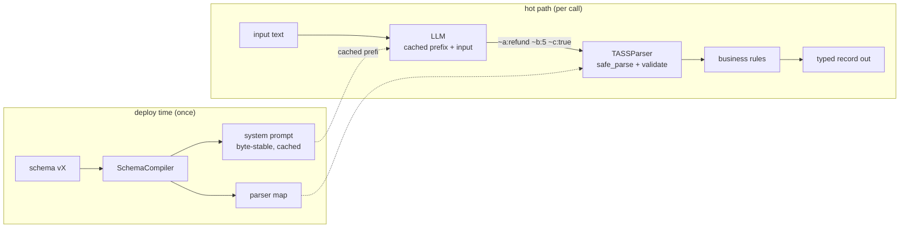
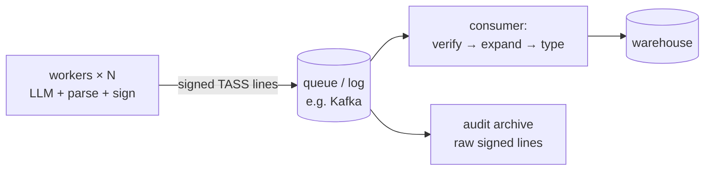
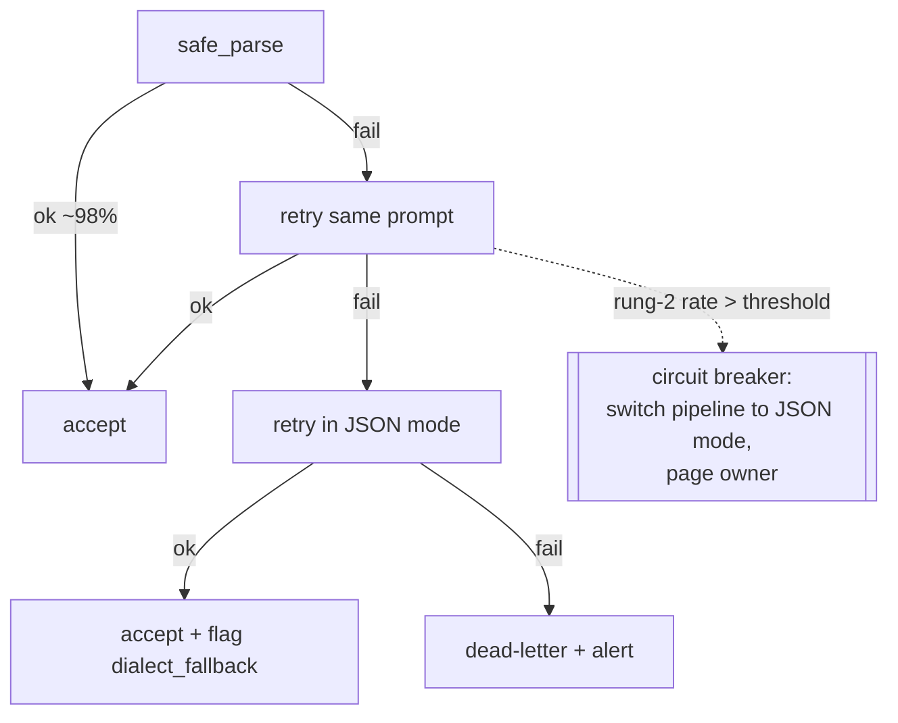

# Chapter 9 — System Design with TASS

> *In which the previous eight chapters assemble into architectures: where
> TASS belongs in a system, the reference patterns, and the operational
> practices that keep it healthy.*

## 9.1 The placement principle

Every architecture in this chapter is a variation on one rule:

> **TASS lives on exactly one link: from the model's decoder to the first
> trusted parser.** Upstream of that link is prompt territory; downstream
> is normal typed data. The rest of your system should not know TASS
> exists.

Corollaries: never propagate raw TASS strings past the parse boundary
(downstream services consuming wire format couples them to symbol
assignments); never let a second service re-parse; and expansion,
validation, and signing all happen at that single boundary.

## 9.2 Pattern I — The synchronous extraction service

The base pattern; everything else extends it. Runnable miniature:
[`snippets/end_to_end_pipeline.py`](../snippets/end_to_end_pipeline.py).



Design notes:

- **Compile at deploy, not per request** — the compiler exists off the
  hot path; the prompt must stay byte-stable for the cache (Ch. 4).
- **The parse boundary is one function** wrapping `safe_parse` +
  `validate` + business rules; give it a single owner and a single
  metrics emitter.
- **Semantic checks live above the parser** (Ch. 5 §5.8): range checks,
  cross-field constraints, allowed-enum enforcement — after coercion,
  before anything consumes the record.

## 9.3 Pattern II — The asynchronous firehose

At volume, extraction runs behind a queue, and a decision appears that
does not exist in Pattern I: **what format crosses the queue?**



Ship **signed raw TASS lines** on the queue, and expand at consumption.
The reasoning:

- A TASS line is 3–5× smaller than its expanded JSON — queue throughput
  and retention costs shrink by the same factor as the LLM bill.
- The MAC (Ch. 8) is computed over canonical wire form; keeping the wire
  form on the queue means every consumer, and the audit archive, can
  verify independently. Expansion first would destroy verifiability.
- This is the *sanctioned exception* to §9.1's "don't propagate raw
  TASS": the queue consumer is a second trusted parser, fed by contract
  (same schema version, same key context), not by accident. The schema
  registry (§9.4) is what makes that contract explicit.

Idempotency comes free: `hash_record()` of the canonical line is a
natural dedup key for at-least-once delivery.

## 9.4 Pattern III — The schema registry

The moment two services or two schema versions exist, symbol assignments
become a coordination problem (`~c` means `requires_routing` in v2 and
`confidence` in v3 — a silent-corruption bug waiting to happen). The fix
is the standard one — a registry — with `.tass` files as the artifact
(Ch. 6). Working miniature:
[`snippets/schema_registry.py`](../snippets/schema_registry.py).

```
schemas/                          ← a git repo; review = schema governance
  ticket_routing/
    v1.tass
    v2.tass                       ← append-only field evolution
  weather_ingest/
    v1.tass
```

Rules that keep it sound:

1. **Versions are immutable.** A published `vN.tass` never changes;
   evolution is a new file. (Cache-friendliness falls out: immutable
   schema ⇒ byte-stable prompt ⇒ permanent cache prefix.)
2. **Producers pin, consumers tolerate.** Each LLM worker pins one
   version; consumers accept a version *range*, which TASS's
   unknown-symbol tolerance (Ch. 3) makes cheap — a v1 consumer reading
   v2 records simply skips the new fields.
3. **Additive-only within a major version.** New fields take fresh
   symbols; renaming or re-typing a symbol is a new major version and a
   new key context (Ch. 8) — cryptographic separation enforcing the
   social rule.
4. **Every record carries its version** — one extra field (`~z:3` by
   convention, ~2 tokens) buys unambiguous replay forever. At firehose
   scale, message-envelope metadata can carry it instead.

## 9.5 Pattern IV — The fallback ladder as circuit breaker

Chapter 5's ladder, promoted to an architectural component
([`snippets/fallback_ladder.py`](../snippets/fallback_ladder.py)):



The promotion is the dashed edge: rung-transition rates, aggregated, form
a **circuit breaker**. If rung-2 entries exceed a threshold (say 5% over
10 minutes), the pipeline as a whole degrades to JSON mode and pages a
human. You pay full JSON prices during the incident, but you never stop
serving. The two conditions that trip it in practice — a silent provider
model swap, or a schema/prompt deploy mismatch — are exactly the ones you
want paged on anyway. The breaker converts TASS's main structural risk
(instruction-following dependence, Ch. 3) from an outage mode into a cost
blip.

## 9.6 Observability: store compact, view expanded

The debuggability tax (Ch. 1) is repaid with tooling, not format changes:

- **Log raw lines, view expanded.** Persist the compact signed line
  (cheap, verifiable); make dashboards and `kubectl logs` pipelines run
  `tass read` / expansion at *view* time. Humans see field names; storage
  sees 17 tokens.
- **The four golden signals for a TASS pipeline:** rung distribution
  (ladder health), field-missing rate *per field* (F3 localized — one
  flaky field usually means one bad dictionary line), MAC verification
  failure rate (should be ~0; nonzero is an incident, not a metric),
  and output tokens per record (drift = model started chattering).
- **Trace the boundary.** The parse function from §9.2 is one span:
  attach `hash_record()` as an attribute, and every downstream anomaly
  can be traced to the exact wire line that produced it.

## 9.7 The decision framework

Compressing Chapters 1–8 into the questions an architect asks, in order:

| # | Question | If no → |
|---|---|---|
| 1 | Fixed schema, repeated ≥10⁴×/day? | Stay with JSON; savings won't clear the taxes (Ch. 1) |
| 2 | Machine-to-machine (no human reads the wire)? | Stay with JSON/TOON; readability is worth the tokens |
| 3 | Flat-ish records (≤1 nesting level, ≤52 fields)? | JSON/TOON for the tree parts; TASS only for flat sub-records (Ch. 3) |
| 4 | Provider offers prompt caching? | Re-run the break-even inequality; TASS may still win at high volume (Ch. 1 §1.6) |
| 5 | Can you deploy the fallback ladder + breaker? | Do not ship TASS without it (§9.5) |

Five yeses → Pattern I; add the queue at scale (II), the registry at two
schemas (III). The patterns are cumulative, and each is independently
removable if its precondition disappears.

## 9.8 Summary

- One placement rule — TASS lives on the decoder→parser link — and four
  patterns: synchronous service, signed-firehose queue, `.tass`-file
  schema registry, and the fallback ladder promoted to circuit breaker.
- The queue pattern ships signed wire lines and expands at consumption,
  preserving both compactness and verifiability.
- Registry rules (immutable versions, pin/tolerate, additive-only,
  version field) turn symbol assignment from a footgun into governance.
- Observability inverts the debuggability tax: store compact, view
  expanded, and alert on rung rates — which also catch silent model
  swaps.

*Next: three complete deployments, end to end — Chapter 10.*
